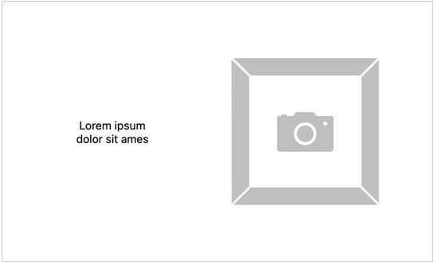
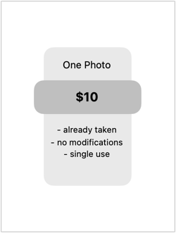
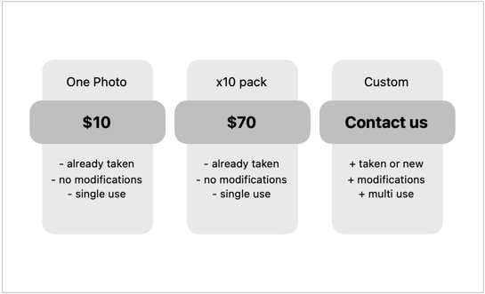
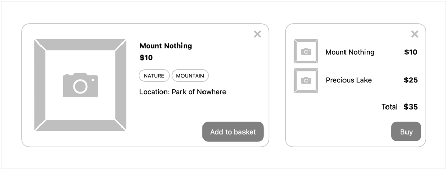

# Projekt: React – podstawy

Cel: rozpoczęcie migracji aplikacji rozwijanej podczas projektów HTML, CSS i JavaScript do React.

Wszelkie style powinny zostać zdefiniowane w modułach CSS.

## Tworzenie nowego projektu

Utwórz nowy projekt w tym repozytorium przy użyciu [Vite](https://vitejs.dev/guide/#scaffolding-your-first-vite-project) i schematu `react`.
Dla uproszczenia nadaj mu nazwę `app`.

## Landing page

Pamiętasz [projekt HTML i CSS](https://github.com/infoshareacademy/jfdzr12-project-html-css#landing-page)?
Stwórz komponent odpowiedzialny za wyświetlenie sekcji ze sloganem firmy. Na razie pomiń nagłówek, wrócimy do niego później.

## Cennik

Zdefiniuj komponent pojedynczej pozycji w cenniku.

Tak jak poprzednio, zawrzyj nazwę pozycji, cenę oraz krótki opis.

Następnie spraw by można było go [ponownie użyć](https://react.dev/learn/passing-props-to-a-component#passing-props-to-a-component) do wyświetlenia różnych pozycji z cennika.

Na koniec przygotuj komponent zawierający cały cennik.

## Galeria

Przygotuj komponent, który zwróci listę zdjęć z portfolio.

Zdefiniuj adresy obrazków poza komponentem jako tablicę napisów, następnie użyj jej jako źródła do wygenerowania listy zdjęć.

Pamiętaj, by zachować pożądaną strukturę DOM – obrazki nie powinny zostać zawarte w żadnym elemencie (np. `div`).

## Okienko modalne

Zostało ci trochę czasu? Przygotuj się na kolejne zajęcia i stwórz komponent odpowiedzialny za wyświetlanie okienka modalnego.
Nie przejmuj się interaktywnością ani dokładną. To, co ważne, to powinno być możliwe zawarcie w nim dowolnej treści. Poniżej to jedynie przykład użycia.

