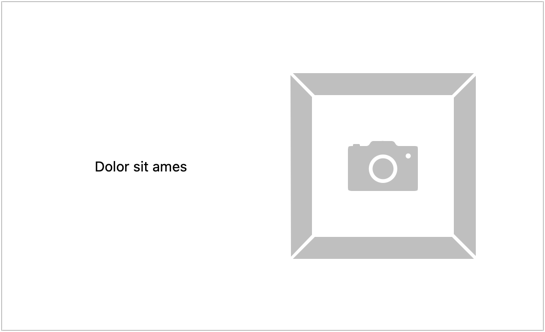

# Projekt: React – stan komponentu

Cel: wprowadzenie dynamiki do aplikacji.

## Statyczny slogan

Pamiętasz [projekt HTML i CSS](https://github.com/infoshareacademy/jfdzr12-project-html-css#landing-page)? Pierwszym widokiem jest obrazek wraz ze sloganem. Odwzoruj go, przechowując slogan jako stan komponentu.

## Dynamiczny slogan

Zmodyfikuj komponent sloganu tak, by co 5 sekund slogan się zmieniał

