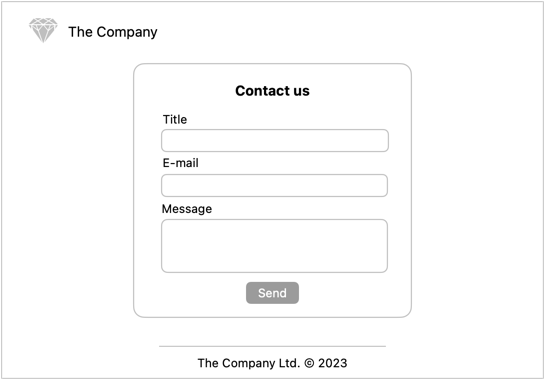

# Projekt: React – formularze

Cel: wprowadzenie do formularzy

## Formularz kontaktowy

Do aplikacji dodaj formularz kontaktowy zawierający pola:
- tytuł (pole wymagane),
- e-mail nadawcy (poprawny adres email),
- treść wiadomości (min 20 znaków).

Rozszerz podstawową funkcjonalność walidacji o weryfikację adresu email pod kątem poprawnej domeny. Poprawny adres email składa się kolejno z:
- nazwy użytkownika (przynajmniej jeden znak alfanumeryczny),
- symbol `@`,
- nazwa domeny niższego rzędu (przynajmniej jeden znak alfanumeryczny),
- kropka (`.`),
- nazwa domeny najwyższego poziomu (tzw. _TLD_, przynajmniej 2 litery).

Przykłady niepoprawnych adresów:
- `dummy@example`,
- `dummy@exampl.e`,
- `dum my@exampl.e`.

Przykłady poprawnych adresów:
- `dum.my@example.io`,
- `dum-my@example.com`,
- `they@teach.us`.
