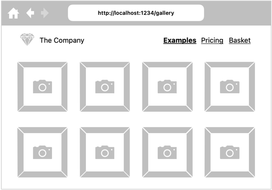
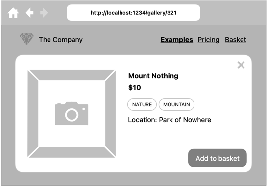
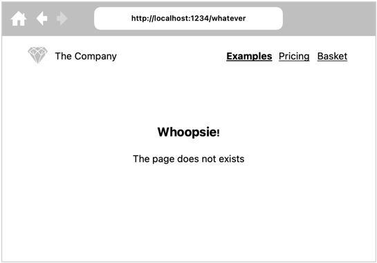

# Projekt: React – routing

Cel: podzielenie aplikacji na podstrony

## Podstrona galerii

Korzystając z biblioteki [React Router](https://reactrouter.com), przenieś [istniejącą galerię](../01-podstawy/README.md#galeria) do osobnej podstrony dostępnej pod ścieżką `/gallery`.

## Podstrona zdjęcia

Dodaj podstronę zdjęcia z wykorzystaniem dynamicznego routingu.

Podstrona nie musi być w pełni funkcjonalna. Najważniejsze jest dynamiczne ładowanie zdjęcia na podstawie ścieżki w pasku adresu.

## Obsługa błędów nawigacji

Jeśli wprowadzony zostanie niewłaściwy adres w pasku adresu, wyświetl komponent informujący o nieznalezionej stornie.

