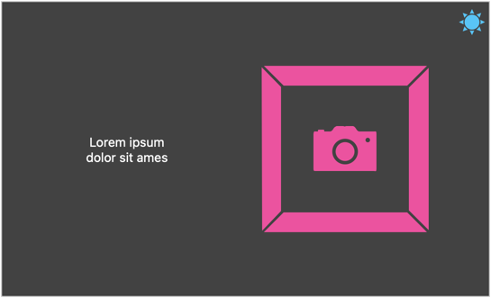

# Projekt: React – Context API

Cel: rozszerzenie aplikacji o stan globalny

## Kolorystyka aplikacji – ciemny i jasny motyw

Korzystając z [Context API](https://react.dev/learn/passing-data-deeply-with-context), wzbogać aplikację o 2 osobne motywy kolorystyczne – jasny i ciemny.

Motyw powinien zmieniać się po kliknięciu przycisku w prawym górnym rogu ekranu.

