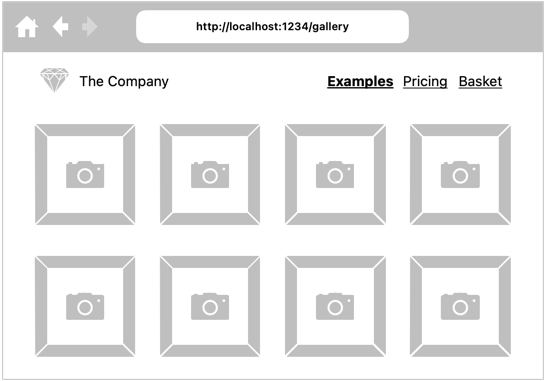
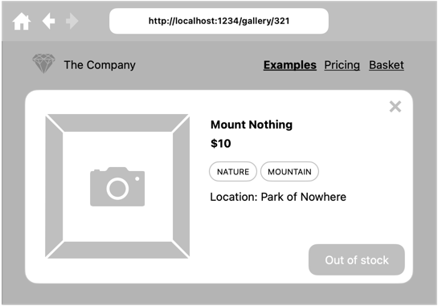

# Projekt: Firebase – podstawy

## Nowy projekt Firebase

Bez obaw, pracujemy nadal na aplikacji, którą wcześniej tworzyliśmy w ramach większości poprzednich zajęć 😃

Załóż nowe konto Firebase, stwórz nowy projekt.

## Firestore

Załóż nową bazę Firestore i skonfiguruj reguły wstępne dostępu.

```
rules_version = '2';

service cloud.firestore {
  match /databases/{database}/documents {
    match /{document=**} {
      allow read, write: if true;
    }
  }
}
```

---

ℹ️ Powyższa konfiguracja umożliwia odczyt i zapis dowolnej osobie.

---

## Integracja z aplikacją

Do aplikacji dodaj konfigurację połączenia z Firebase.

---

**⚠️ Pamiętaj**

Klucze API i inne dane poufne zawsze zapisuj w plikach ignorowanych przez git.

---

Dzięki Vite, konfigurację można wstrzyknąć z pomocą zmiennych środowiskowych.

```shell
# .env.local
# Firebase sensitive
VITE_FIREBASE_API_KEY=
VITE_FIREBASE_APP_ID=
VITE_FIREBASE_DB_URL=
VITE_FIREBASE_MSG_SENDER_ID=
# Firebase non-sensitive
VITE_AUTH_DOMAIN=
VITE_PROJECT_ID=
VITE_STORAGE_BUCKET=
```

```ts
// src/firebase/app.ts
import {initializeApp} from "firebase/app";

const firebaseConfig = {
	apiKey: import.meta.env.VITE_FIREBASE_API_KEY,
	authDomain: import.meta.env.VITE_AUTH_DOMAIN,
	databaseURL: import.meta.env.VITE_FIREBASE_DB_URL,
	projectId: import.meta.env.VITE_PROJECT_ID,
	storageBucket: import.meta.env.VITE_STORAGE_BUCKET,
	messagingSenderId: import.meta.env.VITE_FIREBASE_MSG_SENDER_ID,
	appId: import.meta.env.VITE_FIREBASE_APP_ID
};

export const app = initializeApp(firebaseConfig);
```

## Dynamiczne portfolio

Skonfiguruj kolekcję dokumentów mającą na celu przechowanie informacji o zdjęciach wyświetlanych w portfolio.

Załaduj obrazki przy użyciu API Firebase.



## Karta produktu

Rozszerz kolekcję dokumentów o szczegóły zdjęcia, włączając w to informację o dostępnej ilości.


Do karty produktu w aplikacji dodaj informację o aktualnym braku produktu (np. papierowej kopii fotografii).

Informacja ta powinna zostać odzwierciedlona w aplikacji natychmiast po wykryciu braków
(np. po ręcznej modyfikacji w Firestore).


