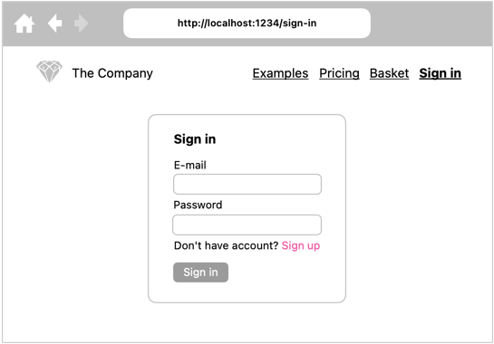
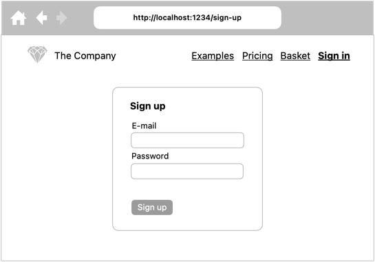
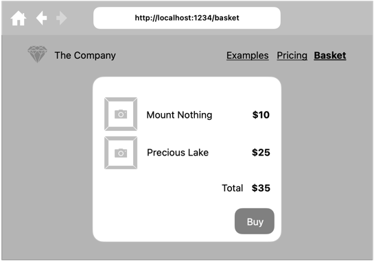

# Projekt: Firebase – uwierzytelnianie i autoryzacja

## Logowanie

Stwórz widok logowania użytkownika.

Na potrzeby weryfikacji poprawności działania formularza, stwórz konto z poziomu konsoli Firebase.

## Rejestracja nowego konta użytkownika

Stwórz widok rejestracji nowego użytkownika.

## Koszyk

Zabezpiecz dostęp do koszyka tylko dla zalogowanych użytkowników.

Użytkownik powinien widzieć tylko produkty we własnym koszyku.

---

💯

Zabezpiecz dane na poziomie reguł Firebase.

---
